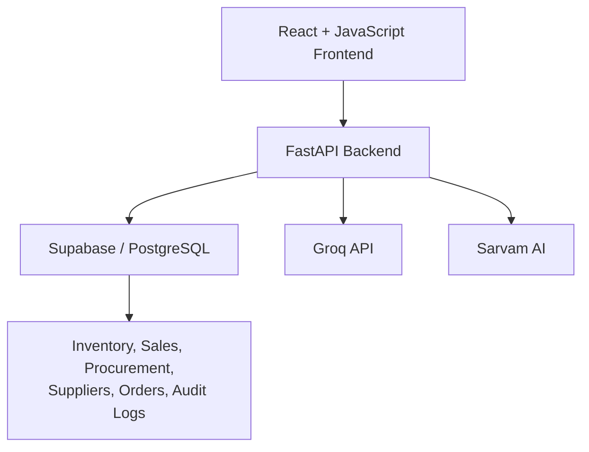

<div align="center">

# 📦 StockOS

### Smart, AI-Powered Inventory Management System

Centralize inventory, sales, procurement, and supplier management — with AI-driven insights to help you make smarter stock decisions.

[](#technology-stack)
[](#technology-stack)
[](#technology-stack)
[](#technology-stack)
[](#technology-stack)
[](#ai-assistant)
[](#project-status)

</div>

---

## 📑 Table of Contents

- [Overview](#overview)
- [Key Highlights](#key-highlights)
- [Roles](#roles)
- [Core Modules](#core-modules)
- [API Overview](#api-overview)
- [System Architecture](#system-architecture)
- [Technology Stack](#technology-stack)
- [Getting Started](#getting-started)
- [Security Considerations](#security-considerations)
- [Project Status](#project-status)
- [Author](#author)

---

## Overview

**StockOS** is an AI-powered inventory management platform that brings inventory tracking, procurement, sales & dispatch, and supplier management into a single system — with **role-based dashboards** and an **AI Assistant (powered by Groq)** for reorder suggestions, anomaly detection, and demand forecasting.

---

## Key Highlights

| | |
|---|---|
| 🤖 **AI-Powered Insights** | Reorder suggestions, anomaly detection, and demand forecasting via Groq |
| 🔐 **4 Role-Based Dashboards** | Admin, Inventory Manager, Sales Manager, Procurement Manager |
| 📊 **Real-Time Dashboards** | Interactive charts and traffic-light stock status via Recharts |
| 📦 **Barcode Workflows** | In-browser barcode generation and camera-based scanning |
| 🚚 **Live Delivery Tracking** | Map-based order tracking with Leaflet |
| 🎙️ **Voice Automation** | Speech-to-text and intent parsing via Sarvam AI |
| 💬 **Team Collaboration** | Built-in group chat and anonymous incident reporting |
| 📜 **Audit Trail** | Full activity logging for accountability |

---

## Roles

StockOS ships with **four primary roles**, each landing on its own dashboard after login:

<details>
<summary><strong>🛡️ Admin</strong></summary>

- Full system-wide access to every module (Inventory, Sales, Procurement)
- User and access management
- Company-wide broadcasts/announcements
- Review of anonymous incident reports
- Full audit trail visibility

</details>

<details>
<summary><strong>📦 Inventory Manager</strong></summary>

- Real-time inventory dashboard and stock stats
- Product & SKU management
- Stock adjustments, batch stock commits, and traffic-light stock status
- Barcode generation and scanning
- AI Assistant, demand forecasting, and reorder alerts
- Audit trail, group chat, and anonymous reporting

</details>

<details>
<summary><strong>💼 Sales Manager (Sales & Dispatch)</strong></summary>

- Sales dashboard with revenue tracking
- Order lifecycle management
- Manufacturing/production tracking
- Live delivery tracking map

</details>

<details>
<summary><strong>🚚 Procurement Manager</strong></summary>

- Procurement dashboard
- Purchase order creation and tracking
- Supplier management and supplier scorecards
- AI-assisted auto-generation of purchase orders

</details>

> **Note:** A few narrower, view-level roles (`warehouse_staff`, `manufacturer`, `accountant`) exist in the permission layer to scope specific nav items, but the four roles above are the ones with dedicated dashboards and login routing.

---

## Core Modules

| Module | What it does |
|---|---|
| **Inventory Dashboard** | Real-time stock stats, low-stock/traffic-light alerts, and interactive analytics |
| **Inventory Management** | Product & SKU management with barcode generation and scanning |
| **Stock Tracking** | Monitors stock movement history and inflow/outflow |
| **Stock Adjustment** | Manual corrections, batch stock commits, and reconciliation |
| **Procurement Management** | Supplier records, purchase orders, and AI-assisted auto-PO generation |
| **Sales & Dispatch** | Order lifecycle tracking, manufacturing status, and live delivery tracking (map) |
| **AI Assistant** | Groq-powered reorder suggestions, anomaly detection, demand forecasting, and natural-language inventory queries |
| **Voice Automation** | Sarvam AI-powered speech-to-text and voice intent parsing |
| **Team Tools** | Group chat, anonymous incident reporting, and admin broadcasts |
| **Audit Trail** | Logs user actions and inventory changes for full traceability |

---

## API Overview

The FastAPI backend (`backend/main.py`) exposes REST endpoints grouped as:

| Area | Endpoints |
|---|---|
| **Products** | `GET/POST/PUT/DELETE /api/products` |
| **Stock** | `/api/stock/adjust`, `/api/stock/barcode`, `/api/stock/batch`, `/api/stock/commit`, `/api/stock/movements` |
| **Inventory** | `/api/inventory/stats`, `/api/inventory/traffic-light` |
| **Suppliers** | `/api/suppliers`, `/api/suppliers/{id}/score` |
| **AI** | `/api/ai/reorder-suggestions`, `/api/ai/anomalies`, `/api/ai/demand-forecast`, `/api/ai/query` |
| **Voice** | `/api/voice/stt`, `/api/voice/tts-confirm`, `/api/voice/parse-intent` |
| **Collaboration** | `/api/chat/{group_name}`, `/api/announcements`, `/api/reports/anonymous`, `/api/notifications` |
| **Audit** | `/api/audit` |

---

## System Architecture



---

## Technology Stack

| Category | Technologies |
|---|---|
| **Frontend** | React (JSX), Vite, Tailwind CSS, React Router, Framer Motion, Recharts, Leaflet, html5-qrcode, JsBarcode |
| **Backend** | Python, FastAPI, Uvicorn, Pydantic, httpx |
| **Database** | Supabase, PostgreSQL |
| **Authentication** | Supabase Authentication |
| **AI Integration** | Groq API |
| **Voice Automation** | Sarvam AI |
| **Version Control** | Git, GitHub |

---

## Getting Started

### Prerequisites

- Node.js & npm
- Python 3.10+
- Git
- A Supabase project + service key
- A Groq API key
- A Sarvam AI API key

### Frontend Setup

```bash
git clone <your-repository-url>
cd StockOS/frontend
npm install
```

Create `frontend/.env`:

```env
VITE_SUPABASE_URL=your_supabase_url
VITE_SUPABASE_ANON_KEY=your_supabase_anon_key
```

Run the dev server:

```bash
npm run dev
```

### Backend Setup

```bash
cd StockOS/backend
pip install fastapi uvicorn python-dotenv supabase groq httpx pydantic
```

Create `backend/.env`:

```env
SUPABASE_URL=your_supabase_url
SUPABASE_SERVICE_KEY=your_supabase_service_key
GROQ_API_KEY=your_groq_api_key
SARVAM_API_KEY=your_sarvam_api_key
FRONTEND_URL=http://localhost:5173
```

Run the API:

```bash
python main.py
```

The API will be available at `http://localhost:8000`, and the frontend at the URL Vite prints in your terminal.

---

## Security Considerations

- ✅ Authenticated user access via Supabase Authentication
- ✅ Role-based dashboard access (Admin, Inventory Manager, Sales Manager, Procurement Manager)
- ✅ Full activity tracking via the audit log endpoint
- ✅ Anonymous incident reporting for sensitive reports

> ⚠️ API keys should always be stored in environment variables and never committed to the repository. Role checks are currently enforced on the frontend — pair this with Supabase Row Level Security policies for defense in depth on the backend.

---

## Project Status

🚧 **Actively developed** — focused on AI-assisted inventory management, operational automation, and business analytics.

---

## Author

**Trrishaa Balakrishnan**

[](https://github.com/Trrr10)
