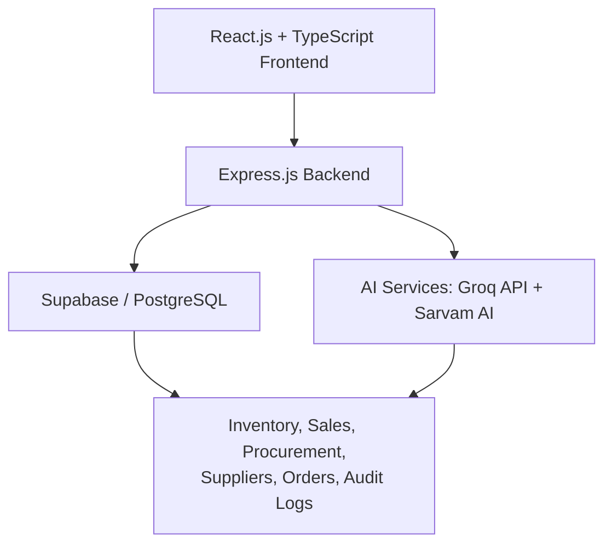
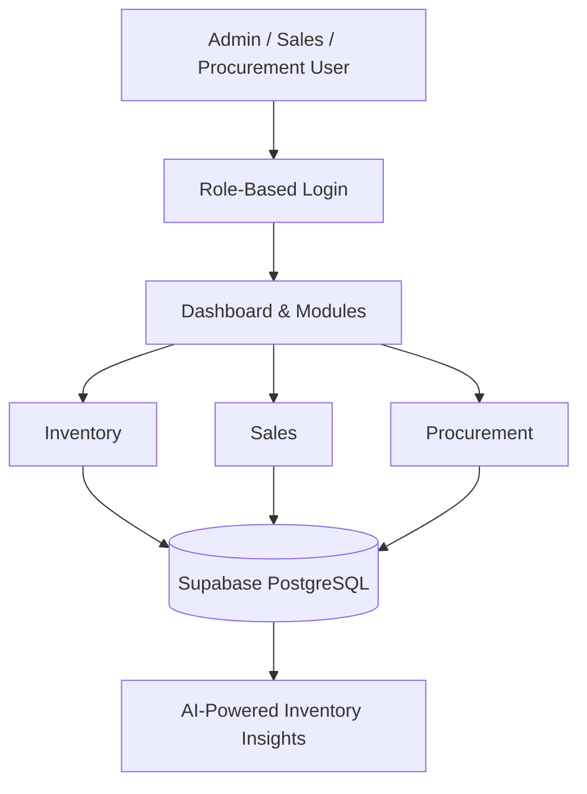

<div align="center">

# 📦 StockOS

### Smart, AI-Powered Inventory Management System

Centralize inventory, sales, procurement, and supplier management — with AI-driven insights to help you make smarter stock decisions.

[](#technology-stack)
[](#technology-stack)
[](#technology-stack)
[](#technology-stack)
[](#ai-assistant)
[](#project-status)
[](#license)

</div>

---

## 📑 Table of Contents

- [Overview](#overview)
- [Key Highlights](#key-highlights)
- [Features](#features)
  - [Role-Based Access Control](#role-based-access-control)
  - [Core Modules](#core-modules)
- [System Architecture](#system-architecture)
- [Main Workflow](#main-workflow)
- [Technology Stack](#technology-stack)
- [Getting Started](#getting-started)
- [Security Considerations](#security-considerations)
- [Project Status](#project-status)
- [Author](#author)

---

## Overview

**StockOS** is an AI-powered inventory management platform built to simplify and automate day-to-day business operations. It brings inventory tracking, procurement, sales, supplier management, and reporting together into a single system — with **role-based access control** so every user sees only what's relevant to their job, and an **AI Assistant (powered by Groq)** to help interpret trends and guide replenishment decisions.

---

## Key Highlights

| | |
|---|---|
| 🤖 **AI-Powered Insights** | Inventory trend analysis via Groq |
| 🔐 **Role-Based Access** | Dedicated workflows for Admin, Sales, and Procurement |
| 📊 **Real-Time Dashboards** | Interactive charts and analytics with Recharts |
| 🔄 **Full Order Lifecycle** | Sales orders, purchase orders, and supplier management |
| 🛠️ **Stock Adjustments** | Manual corrections, damage recording, reconciliation |
| 📜 **Audit Trail** | Full activity logging for accountability |
| 🎙️ **Voice Automation** | Powered by Sarvam AI |
| 📱 **Responsive UI** | Works cleanly across devices |

---

## Features

### Role-Based Access Control

StockOS supports three primary roles, each with a dedicated workflow.

<details>
<summary><strong>🛡️ Admin</strong></summary>

- View overall business operations
- Monitor inventory statistics
- Access the AI Assistant
- View audit trails and stock movement history
- Perform stock adjustments
- Manage users
- Access reports and analytics

</details>

<details>
<summary><strong>💼 Sales</strong></summary>

- Create and manage sales orders
- Track order status
- Update inventory automatically after sales
- View customer orders

</details>

<details>
<summary><strong>📦 Procurement</strong></summary>

- Manage suppliers
- Create and track purchase orders
- Receive and restock inventory
- Monitor procurement history

</details>

---

### Core Modules

| Module | What it does |
|---|---|
| **Inventory Dashboard** | Real-time stock stats, low-stock alerts, sales/procurement summaries, and interactive analytics |
| **Inventory Management** | Product, category, and SKU management with search & filtering |
| **Stock Tracking** | Monitors inflow/outflow and full product-level stock history |
| **Stock Adjustment** | Manual corrections, damaged-stock recording, and reconciliation with a full adjustment history |
| **Procurement Management** | Supplier records, purchase orders, goods received, and restocking workflows |
| **Sales & Orders Management** | Sales order creation, status tracking, and customer management |
| **AI Assistant** | Groq-powered insights, stock optimization suggestions, and replenishment guidance |
| **Audit Trail** | Logs user actions, inventory changes, and system activity for full traceability |

---

## System Architecture



---

## Main Workflow



---

## Technology Stack

| Category | Technologies |
|---|---|
| **Frontend** | React.js, TypeScript, Vite, Tailwind CSS |
| **Backend** | Node.js, Express.js |
| **Database** | Supabase, PostgreSQL |
| **Authentication** | Supabase Authentication |
| **AI Integration** | Groq API |
| **Voice Automation** | Sarvam AI |
| **Charts & Analytics** | Recharts |
| **Version Control** | Git, GitHub |

---

## Getting Started

### Prerequisites

Make sure you have the following installed:

- Node.js
- npm
- Git

You'll also need:

- A Supabase project + credentials
- A Groq API key
- A Sarvam AI API key *(if voice automation is enabled)*

### Installation

```bash
# Clone the repository
git clone <your-repository-url>

# Navigate to the project directory
cd StockOS

# Install dependencies
npm install
```

Create a `.env` file in the project root and add:

```env
VITE_SUPABASE_URL=your_supabase_url
VITE_SUPABASE_ANON_KEY=your_supabase_anon_key
GROQ_API_KEY=your_groq_api_key
SARVAM_API_KEY=your_sarvam_api_key
```

Start the development server:

```bash
npm run dev
```

Then open the local development URL shown in your terminal.

---

## Security Considerations

- ✅ Authenticated user access via Supabase Authentication
- ✅ Role-based permissions across Admin, Sales, and Procurement
- ✅ Controlled inventory modifications
- ✅ Full activity tracking via audit logs
- ✅ Clear separation of administrative, sales, and procurement workflows

> ⚠️ API keys should always be stored in environment variables and never committed to the repository.

---

## Project Status

🚧 **Actively developed** — focused on AI-assisted inventory management, operational automation, and business analytics.

---

## Author

**Trrishaa Balakrishnan**

[](https://github.com/Trrr10)
